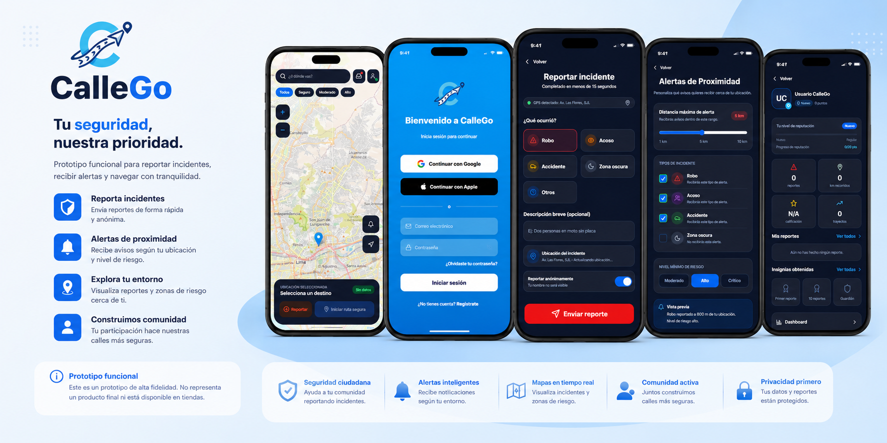

<div align="center">


# 🚦 CalleGo

### Tu seguridad, nuestra prioridad.

<p>


</p>

### Prototipo funcional de alta fidelidad para reportar incidentes, recibir alertas de proximidad y explorar rutas más seguras en tiempo real.

</div>

---

# 📸 Vista previa

<p align="center">

</p>

---

# 📖 Descripción

**CalleGo** es una aplicación web enfocada en mejorar la seguridad ciudadana y la experiencia de movilidad urbana. Permite a las personas **reportar incidentes** de forma rápida y anónima, **recibir alertas** según su ubicación y nivel de riesgo, y **visualizar zonas de riesgo** sobre un mapa interactivo, todo impulsado por la participación de la comunidad.

El proyecto está construido como un prototipo de interfaz **mobile-first**, presentado dentro de un marco de teléfono interactivo (`PhoneFrame`) que simula la experiencia real de la aplicación en un dispositivo móvil.

> ℹ️ **Nota:** Este es un prototipo de alta fidelidad orientado a UI/UX. No representa un producto final ni está disponible en tiendas de aplicaciones.

---

# ✨ Funcionalidades

| Módulo | Funcionalidades |
|--------|------------------|
| 🔐 **Autenticación** | Inicio de sesión, registro, recuperación y cambio de contraseña, verificación por código |
| 🗺️ **Mapa e incidentes** | Mapa de calor de zonas de riesgo, detalle de reportes, selección de rutas seguras |
| 🚨 **Reportes** | Registro de incidentes (robo, acoso, accidente, zona oscura), reporte anónimo, confirmación de envío |
| 🔔 **Alertas** | Alertas de proximidad configurables por distancia, tipo de incidente y nivel de riesgo |
| 🧭 **Navegación** | Navegación guiada y resumen al finalizar el trayecto |
| 👤 **Perfil y comunidad** | Perfil público y privado, historial de reportes, insignias, reputación y notificaciones |
| ⚙️ **Soporte** | Centro de ayuda, políticas de privacidad, dashboard de indicadores |

---

# 🖼️ Pantallas principales

- 🗺️ **Mapa principal** — visualización de reportes y zonas de riesgo cercanas
- 🔑 **Inicio de sesión** — acceso con correo, Google o Apple
- 📝 **Reportar incidente** — formulario rápido con opción de reporte anónimo
- 🔔 **Alertas de proximidad** — configuración de distancia y tipo de aviso
- 👤 **Perfil** — reportes propios, insignias y nivel de reputación

---

# 🛠 Stack Tecnológico

<div align="center">


<br><br>


</div>

---

# 🏛 Arquitectura

El proyecto está organizado como una aplicación **React + Vite** basada en componentes y páginas, con enrutamiento declarativo mediante **React Router**.

```text
📦 src
│
├── assets          # Íconos, wallpapers y recursos gráficos
├── components       # Componentes reutilizables (PhoneFrame, AuthInput, ZoomControls...)
├── pages             # Pantallas de la aplicación (Login, Dashboard, ReportIncident...)
├── App.jsx           # Definición de rutas
├── main.jsx          # Punto de entrada
└── index.css         # Estilos globales
```

---

# 📂 Estructura del proyecto

```text
app-CalleGo
│
├── docs
│   ├── logo.png
│   └── preview.png
│
├── src
│   ├── assets
│   ├── components
│   │   ├── AuthInput.jsx
│   │   ├── PhoneFrame.jsx
│   │   └── ZoomControls.jsx
│   ├── pages
│   │   ├── Splash.jsx
│   │   ├── Onboarding.jsx
│   │   ├── Login.jsx / Register.jsx
│   │   ├── ForgotPassword.jsx / VerifyCode.jsx / ResetPassword.jsx / ChangePassword.jsx
│   │   ├── HomeScreen.jsx / HeatMap.jsx / RouteSelection.jsx / Navigation.jsx / TripComplete.jsx
│   │   ├── ReportIncident.jsx / ReportDetail.jsx / ReportSuccess.jsx / MyReports.jsx
│   │   ├── Alerts.jsx / Notifications.jsx
│   │   ├── Profile.jsx / PublicProfile.jsx / Badges.jsx / Privacy.jsx / Help.jsx
│   │   └── Dashboard.jsx
│   ├── App.jsx
│   ├── App.css
│   ├── index.css
│   └── main.jsx
│
├── index.html
├── vite.config.js
├── eslint.config.js
└── package.json
```

---

# 🚀 Instalación

## Clonar el proyecto

```bash
git clone https://github.com/yxdhii/app-CalleGo.git
```

## Acceder al proyecto

```bash
cd app-CalleGo
```

## Instalar dependencias

```bash
pnpm install
```

## Ejecutar en modo desarrollo

```bash
pnpm run dev
```

## Compilar para producción

```bash
pnpm run build
```

---

# 🌐 Acceso

```
http://localhost:5173
```

---

# 📌 Estado del proyecto

🚧 **En desarrollo activo** — nuevas funcionalidades y mejoras de UI/UX en progreso.

---

<div align="center">

## 👩🏻‍💻 Desarrollado por

### **Yadhira Patricia Saavedra Guadalupe**

Estudiante de **Ingeniería de Sistemas**  
Universidad Tecnológica del Perú (UTP)

<br>

[](https://www.linkedin.com/in/itsyxdhi/)
[](https://yadhira-portafolio.vercel.app)
[](https://github.com/yxdhii)

<br>

⭐ **Si este proyecto te resultó útil, considera darle una estrella al repositorio.**

© 2026 · CalleGo

</div>